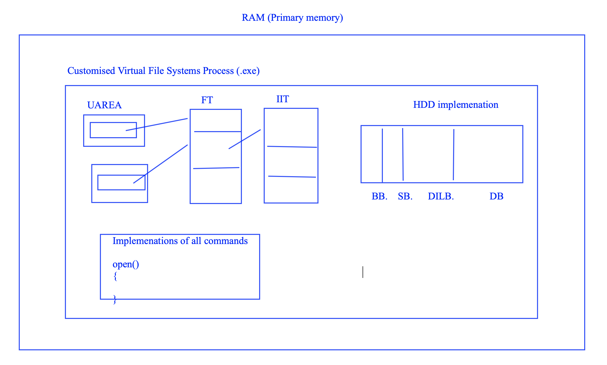
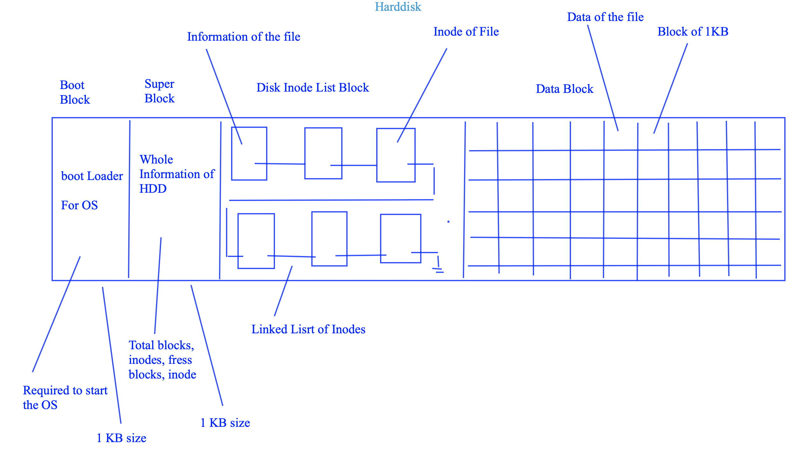
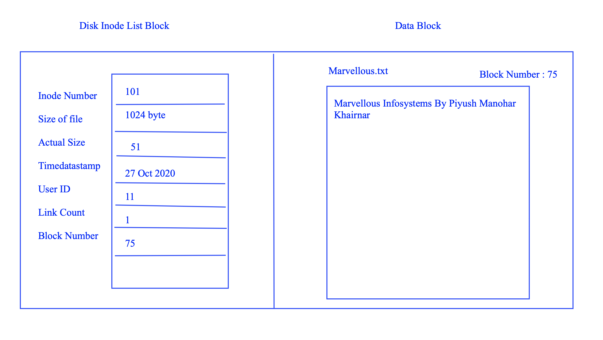
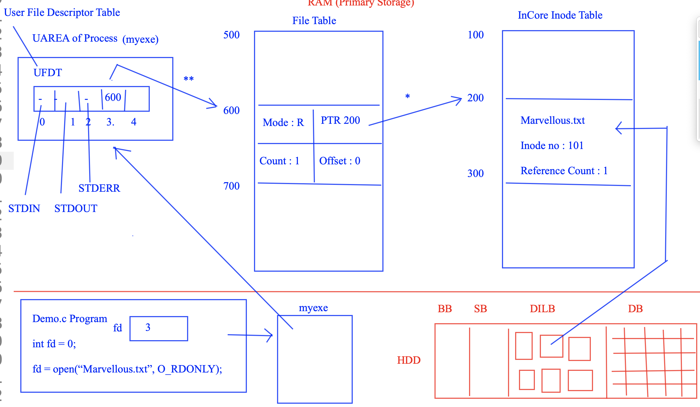

# Customised Virtual File System (CVFS)



## Overview

The **Customised Virtual File System (CVFS)** is a C++-based, in-memory file system emulator that replicates core UNIX-like file system behaviors. It is designed for educational and research purposes, providing a hands-on understanding of file system internals such as inode management, file operations, and user-space interaction.

---

## Features

- **In-Memory File System:** All operations are performed in RAM, with no disk I/O.
- **UNIX-like Commands:** Supports commands such as `creat`, `open`, `read`, `write`, `ls`, `stat`, `fstat`, `truncate`, `rm`, `lseek`, `close`, and `closeall`.
- **Custom Shell Interface:** Interactive CLI for file system operations.
- **File Metadata Management:** Implements superblock, inode table, file table, and UFDT (User File Descriptor Table).
- **Permission Handling:** Supports read, write, and read-write permissions.
- **Resource Management:** Handles file descriptors, reference counts, and memory allocation.

---

## Architecture


- **Superblock:** Tracks total and free inodes.
- **Inode Table:** Stores metadata for each file (name, size, type, permissions, etc.).
- **File Table:** Maintains open file state (offsets, mode, reference count).
- **UFDT:** Maps file descriptors to file table entries.
- **Buffer:** Each file has a dedicated buffer for its contents.

For detailed diagrams and flowcharts, see [docs/CustomisedVirtualFileSystem_Project_Documation.pdf](docs/CustomisedVirtualFileSystem_Project_Documation.pdf).

---

## Getting Started

### Prerequisites

- GCC/g++ compiler (Linux/Windows)
- Command-line terminal

### Build Instructions

```sh
git clone https://github.com/yourusername/CustomisedVirtualFileSystem.git
cd CustomisedVirtualFileSystem/src
g++ Source_Code.cpp -o CVFS
```

### Running the Application

```sh
./CVFS
```

---

## Usage

Once started, the shell accepts the following commands:

| Command                | Description                                 | Example Usage                   |
|------------------------|---------------------------------------------|---------------------------------|
| `creat <name> <perm>`  | Create a new file with permissions          | `creat myfile 3`                |
| `open <name> <mode>`   | Open an existing file                       | `open myfile 1`                 |
| `read <name> <bytes>`  | Read bytes from a file                      | `read myfile 100`               |
| `write <name>`         | Write data to a file (prompts for input)    | `write myfile`                  |
| `ls`                   | List all files                              | `ls`                            |
| `stat <name>`          | Show file metadata by name                  | `stat myfile`                   |
| `fstat <fd>`           | Show file metadata by descriptor            | `fstat 0`                       |
| `truncate <name>`      | Remove all data from a file                 | `truncate myfile`               |
| `rm <name>`            | Delete a file                               | `rm myfile`                     |
| `lseek <name> <off> <whence>` | Change file offset                  | `lseek myfile 10 0`             |
| `close <name>`         | Close a file                                | `close myfile`                  |
| `closeall`             | Close all open files                        | `closeall`                      |
| `help`                 | Display help information                    | `help`                          |
| `exit`                 | Exit the shell                              | `exit`                          |

**Permissions:**  
- `1` = Read  
- `2` = Write  
- `3` = Read & Write

---

## Example Session


```sh
Abhishek Atole CVFS :> creat test 3
File is successfully created with file descriptor : 0

Abhishek Atole CVFS :> write test
Enter the data to write file :
Hello, CVFS!
13 bytes gets written successfully in the file

Abhishek Atole CVFS :> read test 13
Hello, CVFS!

Abhishek Atole CVFS :> ls
File Name   Inode number   File iSize   Link iCount
test        1              13           1

Abhishek Atole CVFS :> exit
Thank-you for using My Virtual File System
```

---

## Documentation

- [Project Documentation PDF](docs/CustomisedVirtualFileSystem_Project_Documation.pdf)
- [Architecture Diagrams Folder](docs/)

### Visuals

- **Final Run Executable Screenshot:**  
  

- **Hard Disk Info Diagram:**  
  

- **Inode Information Diagram:**  
  

- **RAM Processing Diagram:**  
  

---

## Contributing

Contributions, issues, and feature requests are welcome!  
Please open an issue or submit a pull request.

---

## License

This project is licensed under the [MIT License](LICENSE).

---

## Author

**Abhishek Atole**  
[LinkedIn](#) • [GitHub](#)

---
